

# ixmaps-gl Stage

Interactive map examples built with [ixmaps-gl](https://github.com/gjrichter/ixmaps-gl) — the same declarative ixmaps API, rendered with MapLibre GL JS + deck.gl. Live at **https://gl.ixmaps.com/stage/**

---

## Root

<a href="https://gl.ixmaps.com/stage/accidents_app.html">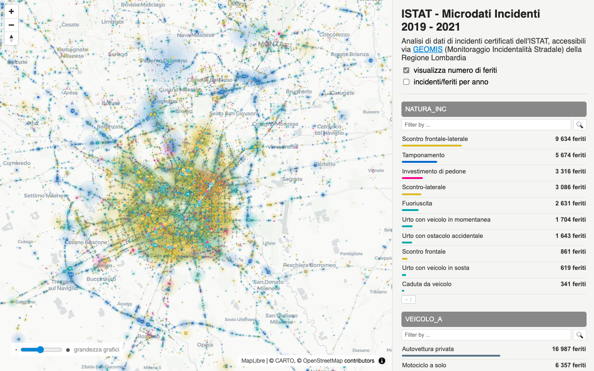</a> 
<b>ISTAT road accidents, Lombardia 2019–2021</b> 
Certified ISTAT accident microdata (GEOMIS / AREU): accident type sized by injuries, per-year curves and a facet browser. 
<a href="https://gl.ixmaps.com/stage/accidents_app.html">OPEN →</a> &nbsp;·&nbsp; <a href="https://gjrichter.github.io/MapCodeViewer/?url=https://gl.ixmaps.com/stage/accidents_app.html">see code →</a>

<a href="https://gl.ixmaps.com/stage/demo_accidents.html">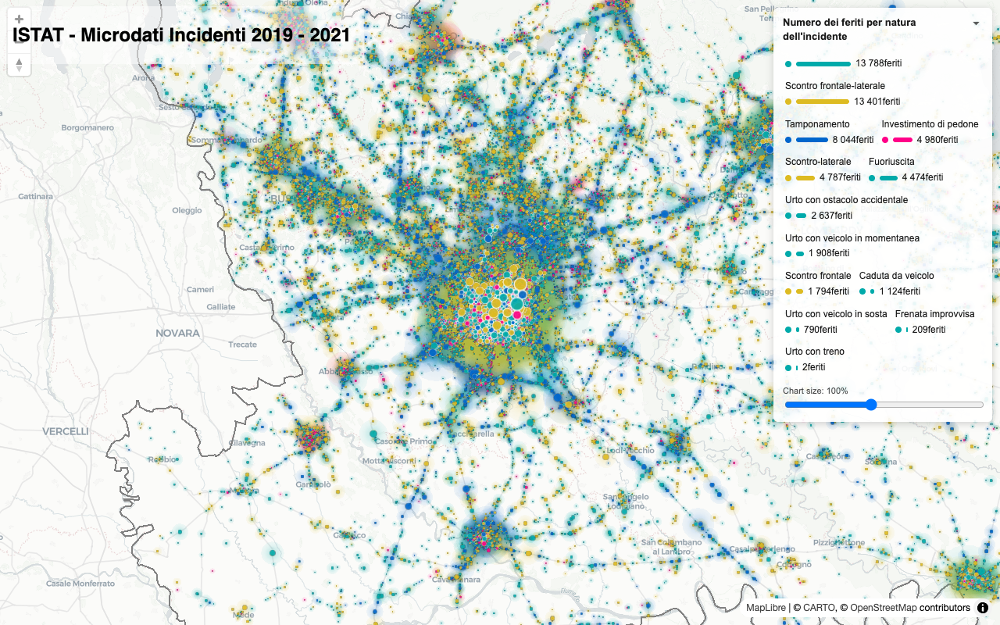</a> 
<b>ISTAT road accidents — minimal</b> 
The same Lombardia accident data as the map above, stripped down to the map alone: accident type by number of injured. 
<a href="https://gl.ixmaps.com/stage/demo_accidents.html">OPEN →</a> &nbsp;·&nbsp; <a href="https://gjrichter.github.io/MapCodeViewer/?url=https://gl.ixmaps.com/stage/demo_accidents.html">see code →</a>

<a href="https://gl.ixmaps.com/stage/germany_accidents_app_2023_2025.html">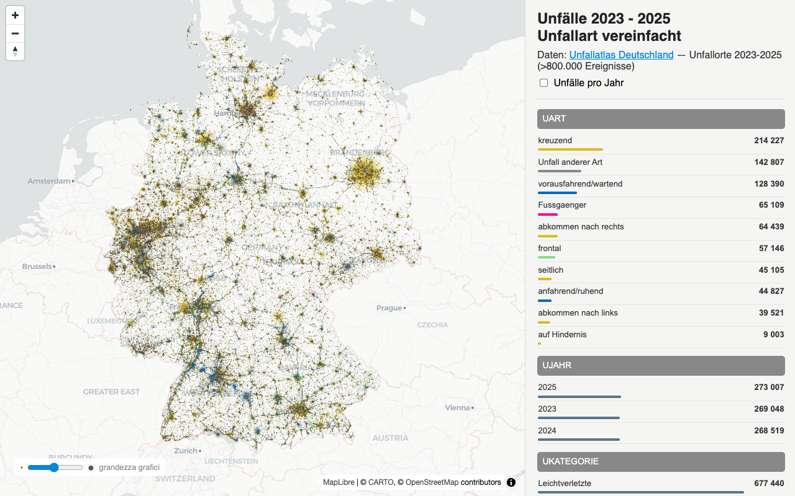</a> 
<b>Germany road accidents 2023–2025</b> 
Unfallatlas accident locations across Germany, coloured by accident type, with per-year curves and step-by-step loading messages. 
<a href="https://gl.ixmaps.com/stage/germany_accidents_app_2023_2025.html">OPEN →</a> &nbsp;·&nbsp; <a href="https://gjrichter.github.io/MapCodeViewer/?url=https://gl.ixmaps.com/stage/germany_accidents_app_2023_2025.html">see code →</a>

<a href="https://gl.ixmaps.com/stage/germany_accidents_app.html">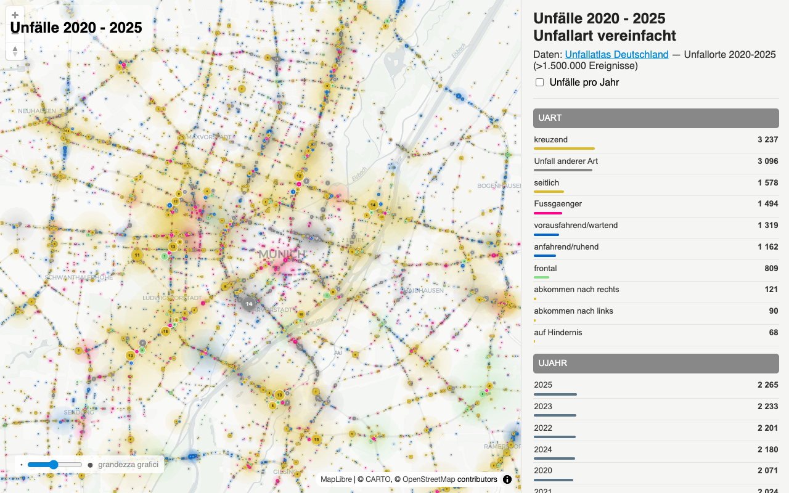</a> 
<b>Germany road accidents 2020–2025</b> 
The full Unfallatlas series 2020–2025, over a million accident locations, with per-year curves and a facet browser. 
<a href="https://gl.ixmaps.com/stage/germany_accidents_app.html">OPEN →</a> &nbsp;·&nbsp; <a href="https://gjrichter.github.io/MapCodeViewer/?url=https://gl.ixmaps.com/stage/germany_accidents_app.html">see code →</a>

<a href="https://gl.ixmaps.com/stage/uk_collisions_2023.html">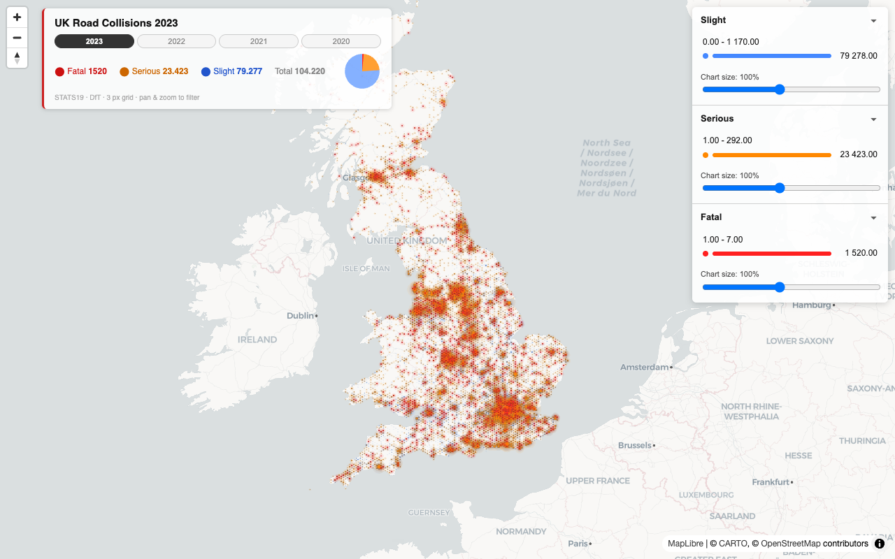</a> 
<b>UK road collisions 2023</b> 
All recorded UK road collisions (STATS19, DfT) on a 3 px grid, coloured by severity, with totals per year; pan and zoom to filter. 
<a href="https://gl.ixmaps.com/stage/uk_collisions_2023.html">OPEN →</a> &nbsp;·&nbsp; <a href="https://gjrichter.github.io/MapCodeViewer/?url=https://gl.ixmaps.com/stage/uk_collisions_2023.html">see code →</a>

<a href="https://gl.ixmaps.com/stage/global_power_plants_sidebar.html">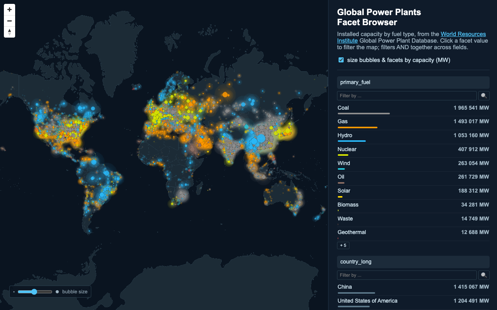</a> 
<b>Global power plants — facet browser</b> 
Installed capacity by fuel type from the WRI Global Power Plant Database; click a facet value to filter the map. 
<a href="https://gl.ixmaps.com/stage/global_power_plants_sidebar.html">OPEN →</a> &nbsp;·&nbsp; <a href="https://gjrichter.github.io/MapCodeViewer/?url=https://gl.ixmaps.com/stage/global_power_plants_sidebar.html">see code →</a>

<a href="https://gl.ixmaps.com/stage/global_power_plants_world_map.html">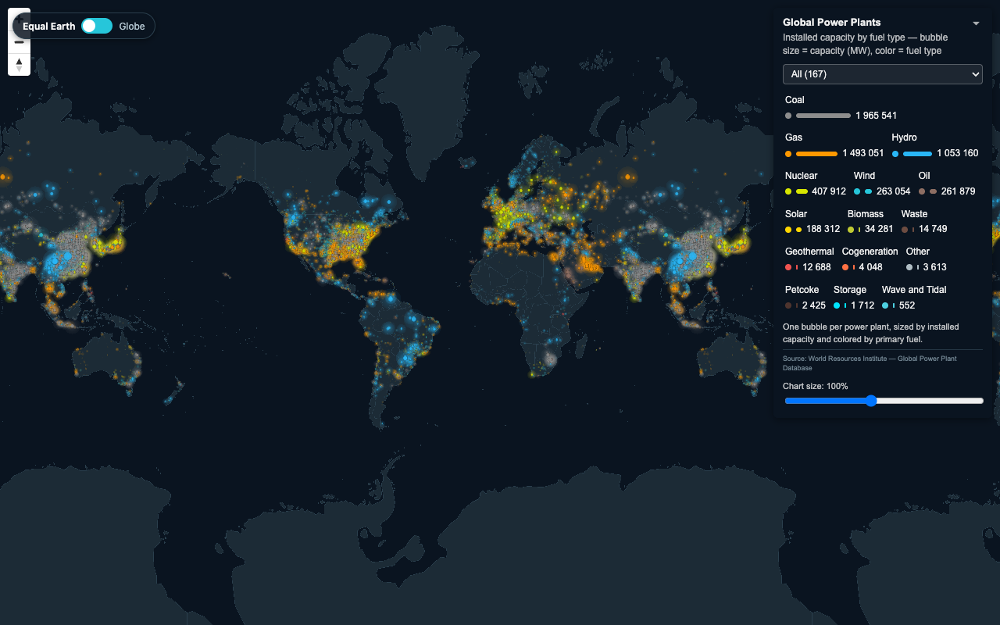</a> 
<b>Global power plants — map / globe switch</b> 
The same power-plant data with a live switch between a flat map and a globe projection. 
<a href="https://gl.ixmaps.com/stage/global_power_plants_world_map.html">OPEN →</a> &nbsp;·&nbsp; <a href="https://gjrichter.github.io/MapCodeViewer/?url=https://gl.ixmaps.com/stage/global_power_plants_world_map.html">see code →</a>

<a href="https://gl.ixmaps.com/stage/roma_incidenti_pericolosita_sidebar_gl.html">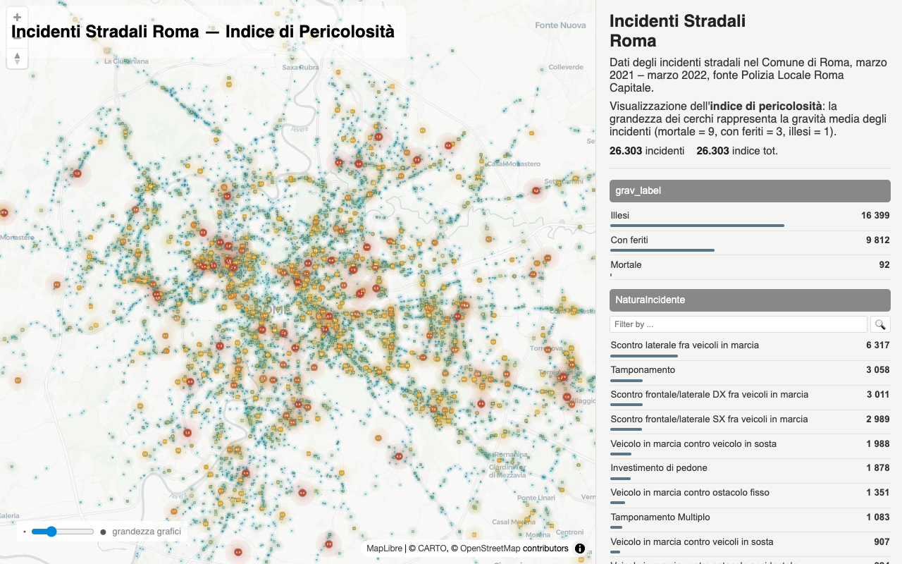</a> 
<b>Rome road accidents — danger index (ixmaps-gl)</b> 
Accidents in Rome, March 2021 – March 2022: circle size shows the average severity (fatal = 9, injured = 3, unhurt = 1). Runs on ixmaps-gl. 
<a href="https://gl.ixmaps.com/stage/roma_incidenti_pericolosita_sidebar_gl.html">OPEN →</a> &nbsp;·&nbsp; <a href="https://gjrichter.github.io/MapCodeViewer/?url=https://gl.ixmaps.com/stage/roma_incidenti_pericolosita_sidebar_gl.html">see code →</a>

<a href="https://gl.ixmaps.com/stage/roma_incidenti_pericolosita_sidebar.html">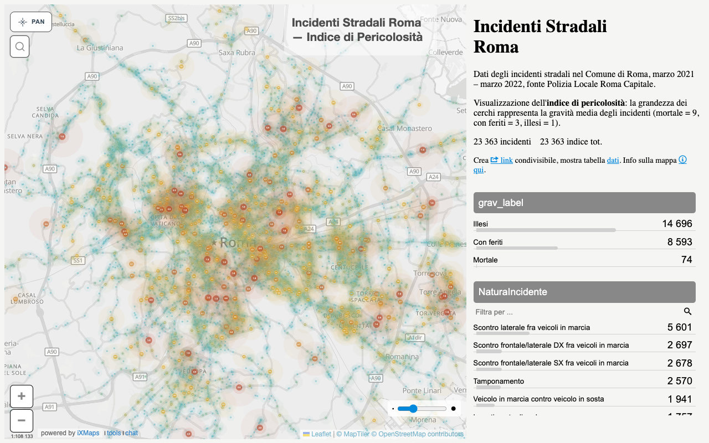</a> 
<b>Rome road accidents — danger index (ixmaps-flat)</b> 
The original ixmaps-flat version of the same map, for comparison with the ixmaps-gl one. 
<a href="https://gl.ixmaps.com/stage/roma_incidenti_pericolosita_sidebar.html">OPEN →</a> &nbsp;·&nbsp; <a href="https://gjrichter.github.io/MapCodeViewer/?url=https://gl.ixmaps.com/stage/roma_incidenti_pericolosita_sidebar.html">see code →</a>

<a href="https://gl.ixmaps.com/stage/mappa_stranieri_30.html">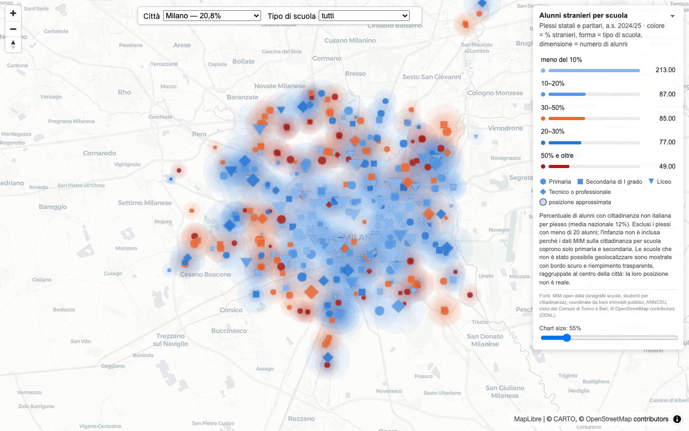</a> 
<b>Foreign pupils per school</b> 
Schools as bubbles coloured by class, sized by the number of foreign pupils, with filters by city and school type. 
<a href="https://gl.ixmaps.com/stage/mappa_stranieri_30.html">OPEN →</a> &nbsp;·&nbsp; <a href="https://gjrichter.github.io/MapCodeViewer/?url=https://gl.ixmaps.com/stage/mappa_stranieri_30.html">see code →</a>

---

## Tools

Standalone tools (not map demos).

<a href="https://gl.ixmaps.com/stage/ixmaps-loader_70.html">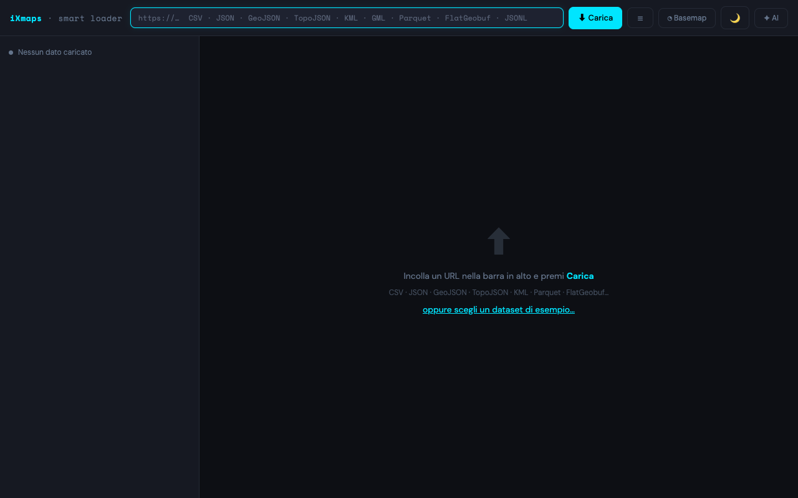</a> 
<b>iXmaps Smart Data Loader</b> 
Paste a URL or load a file (CSV, JSON, GeoJSON, TopoJSON, …) to inspect it and build an ixmaps layer, with optional AI-assisted configuration. 
<a href="https://gl.ixmaps.com/stage/ixmaps-loader_70.html">OPEN →</a> &nbsp;·&nbsp; <a href="https://gjrichter.github.io/MapCodeViewer/?url=https://gl.ixmaps.com/stage/ixmaps-loader_70.html">see code →</a>

